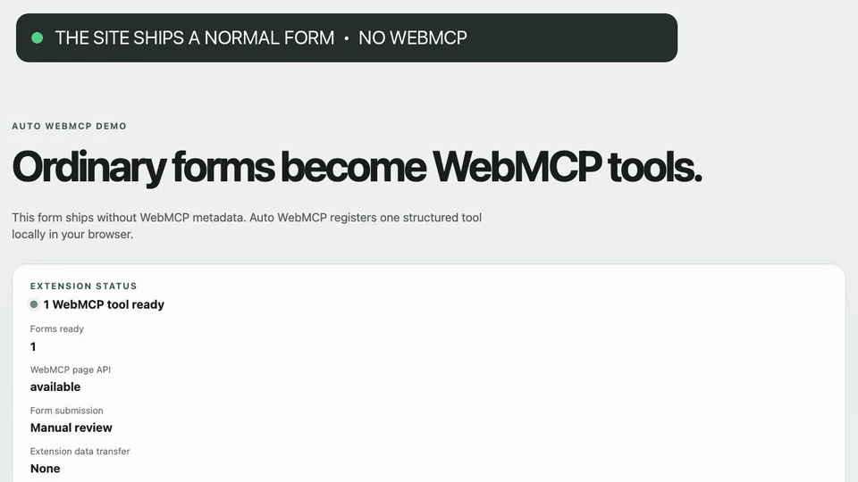

# Auto WebMCP

[](https://github.com/pauloportella/auto-webmcp-chrome/actions/workflows/ci.yml)
[](LICENSE)

Auto WebMCP turns standard web forms into structured WebMCP tools. Compatible browser agents can discover a form's fields and populate several controls in one structured action, while final submission remains under the user's control.

## Demo

[](artwork/demo.mp4)

A site ships a normal form without WebMCP. Auto WebMCP upgrades it into a structured tool that a compatible agent can discover and call.

## Capabilities

- Creates a tool and JSON Schema from native form controls, labels, ARIA text, choices, and validation constraints.
- Supports text fields, text areas, selects, multi-selects, radio groups, checkboxes, dates, times, numbers, and other standard inputs.
- Detects forms added or changed by client-side applications.
- Preserves forms already annotated with declarative WebMCP metadata.
- Excludes hidden inputs, disabled controls, read-only controls, file uploads, and controls marked `aria-hidden`.
- Shows the generated form and tool count in the toolbar popup.
- Populates controls without submitting the form.

Auto WebMCP runs on top-level HTTP and HTTPS pages. Chrome protects internal pages, including `chrome://` pages and the Chrome Web Store, from extension content scripts.

## Compatibility

Chrome 149 or later is required. Auto WebMCP uses Chrome's native `document.modelContext` API when available and otherwise uses a packaged compatibility runtime. No experimental Chrome flag is required to expose the page API; end-to-end discovery and invocation still depend on the browser agent or client.

WebMCP is an emerging browser API. A compatible browser agent or client is required to discover and invoke the generated tools.

To support agents that inspect semantic page snapshots, Auto WebMCP adds a visually hidden availability note to annotated pages. It does not alter the visible layout, but assistive-technology browse modes may encounter the note.

## Privacy

Form analysis and tool execution happen locally in the browser. Auto WebMCP does not operate analytics, advertising, telemetry, accounts, or remote services. It never submits a form. See [PRIVACY.md](PRIVACY.md) for the complete policy.

## Build from source

Install the locked dependencies and create a production build:

```sh
pnpm install --frozen-lockfile
pnpm build
```

Load `dist/` from `chrome://extensions` using **Load unpacked**.

## Development

```sh
pnpm dev
```

The development command rebuilds `dist/` and serves the form lab at <http://127.0.0.1:4173>. Keep the form lab open while developing so source changes reload the unpacked extension and affected tabs automatically.

## Verification and packaging

```sh
pnpm check
pnpm package
```

`pnpm package` creates `release/auto-webmcp-0.10.1.zip`, the versioned production archive. Development reload code is excluded from that archive.

## Contributing and security

Contributions are welcome. See [CONTRIBUTING.md](CONTRIBUTING.md) for the development workflow and [SECURITY.md](SECURITY.md) for private vulnerability reporting.

## License

Auto WebMCP is available under the [MIT License](LICENSE).
Third-party software notices are listed in [THIRD_PARTY_NOTICES.txt](THIRD_PARTY_NOTICES.txt).
